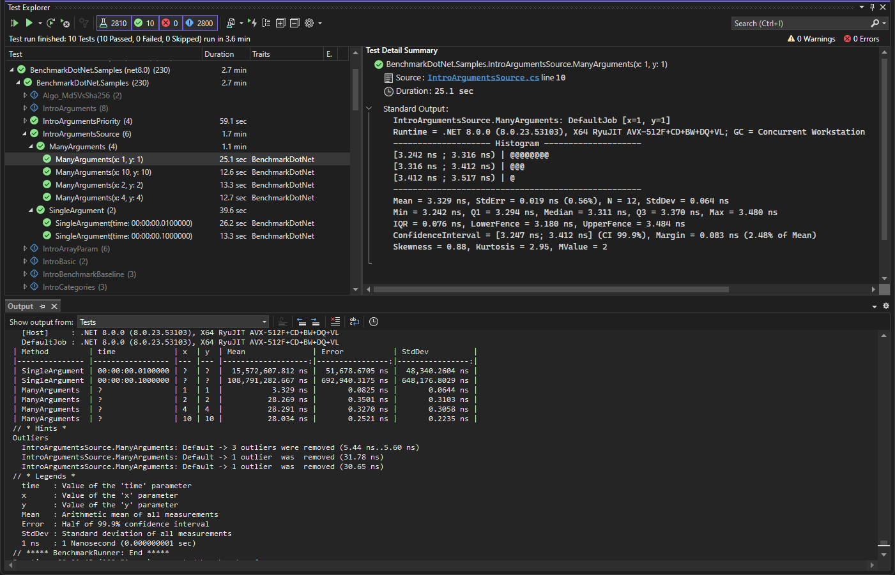

# Running with VSTest
BenchmarkDotNet has support for discovering and executing benchmarks through VSTest. This provides an alternative user experience to running benchmarks with the CLI and may be preferable for those who like their IDE's VSTest integrations that they may have used when running unit tests.

Below is an example of running some benchmarks from the BenchmarkDotNet samples project in Visual Studio's Test Explorer.



## About VSTest

VSTest is one of the most popular test platforms in use in the .NET ecosystem, with test frameworks such as MSTest, xUnit, and NUnit providing support for it. Many IDEs, including Visual Studio and Rider, provide UIs for running tests through VSTest which some users may find more accessible than running them through the command line. 

It may seem counterintuitive to run performance tests on a platform that is designed for unit tests that expect a boolean outcome of "Passed" or "Failed", however VSTest provides good value as a protocol for discovering and executing tests. In addition, we can still make use of this boolean output to indicate if the benchmark had validation errors that caused them to fail to run.

## Caveats and things to know
- The VSTest adapter will not call your application's entry point.
  - If you use the entry point to customize how your benchmarks are run, you will need to do this through other means such as an assembly-level `IConfigSource`.
  - For more about this, please read: [Setting a default configuration](#setting-a-default-configuration).
- The benchmark measurements may be affected by the VSTest host and your IDE 
  - If you want to have more accurate performance results, it is recommended to run benchmarks through the CLI instead without other processes on the machine impacting performance.
  - This does not mean that the measurements are useless though, it will still be able to provide useful measurements during development when comparing different approaches.
- The test adapter will not display or execute benchmarks if optimizations are disabled.
  - Please ensure you are compiling in Release mode or with `Optimize` set to true.
  - Using an `InProcess` toolchain will let you run your benchmarks with optimizations disabled and will let you attach the debugger as well.
- The test adapter will generate an entry point for you automatically
  - The generated entry point will pass the command line arguments and the current assembly into `BenchmarkSwitcher`, so you can still use it in your CLI as well as in VSTest.
  - This means you can delete your entry point and only need to define your benchmarks.
  - If you want to use a custom entry point, you can still do so by setting `GenerateProgramFile` to `false` in your project file.

## How to use it

You need to install two packages into your benchmark project:

- `BenchmarkDotNet.TestAdapter`: Implements the VSTest protocol for BenchmarkDotNet
- `Microsoft.NET.Test.Sdk`: Includes all the pieces needed for the VSTest host to run and load the VSTest adapter.

As mentioned in the caveats section, `BenchmarkDotNet.TestAdapter` will generate an entry point for you automatically, so if you have an entry point already you will either need to delete it or set `GenerateProgramFile` to `false` in your project file to continue using your existing one.

After doing this, you can set your build configuration to `Release`, run a build, and you should be able to see the benchmarks in your IDE's VSTest integration.

## Setting a default configuration

Previously, it was common for the default configuration to be defined inside the entry point. Since the entry point is not used when running benchmarks through VSTest, the default configuration must be specified using a `Config` attribute instead that is set on the assembly. 

First, create a class that extends `ManualConfig` or `IConfig` which sets the default configuration you want:

```csharp
class MyDefaultConfig : ManualConfig
{
    public MyDefaultConfig()
    {
        AddJob(Job.Dry);
        AddLogger(Loggers.ConsoleLogger.Default); 
        AddValidator(JitOptimizationsValidator.DontFailOnError); 
    }
}
```

Then, set an assembly attribute with the following.

```csharp
[assembly: Config(typeof(MyDefaultConfig))]
```

By convention, assembly attributes are usually defined inside `AssemblyInfo.cs` in a directory called `Properties`.

## Viewing the results
The full output from BenchmarkDotNet that you would have been used to seeing in the past will be sent to the "Tests" output of your IDE. Use this view if you want to see the tabular view that compares multiple benchmarks with each other, or if you want to see the results for each individual iteration.

One more place where you can view the results is in each individual test's output messages. In Visual Studio this can be viewed by clicking on the test in the Test Explorer after running it, and looking at the Test Detail Summary. Since this only displays statistics for a single benchmark case, it does not show the tabulated view that compares multiple benchmark cases, but instead displays a histogram and various other useful statistics. Not all IDEs support displaying these output messages, so you may only be able to view the results using the "Tests" output.